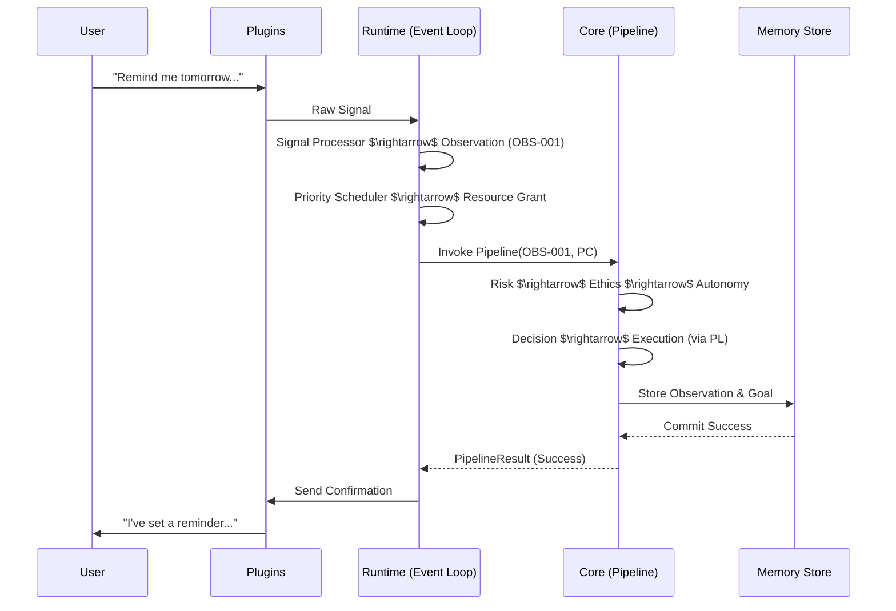
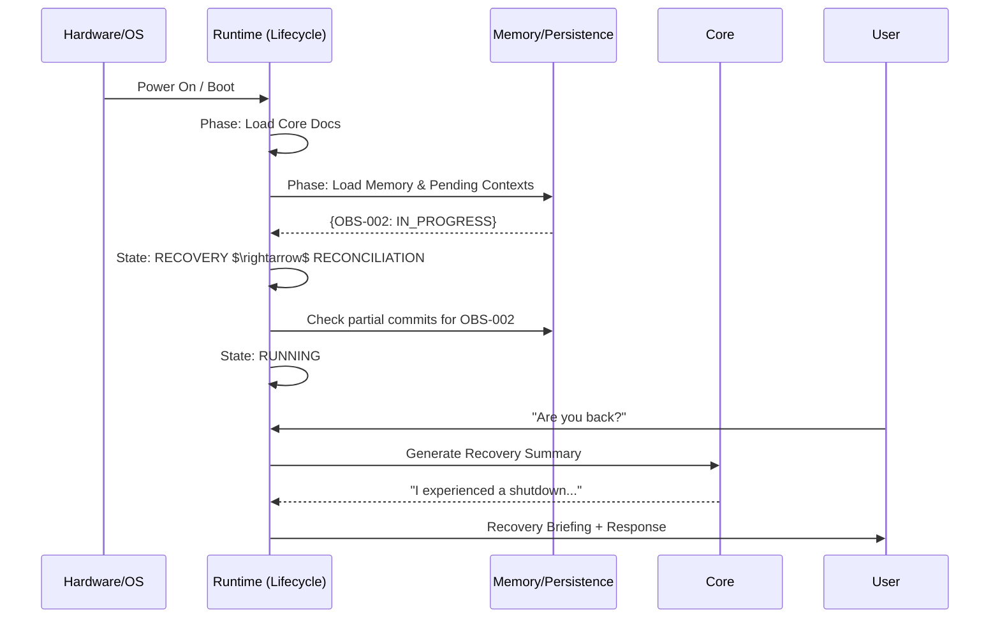
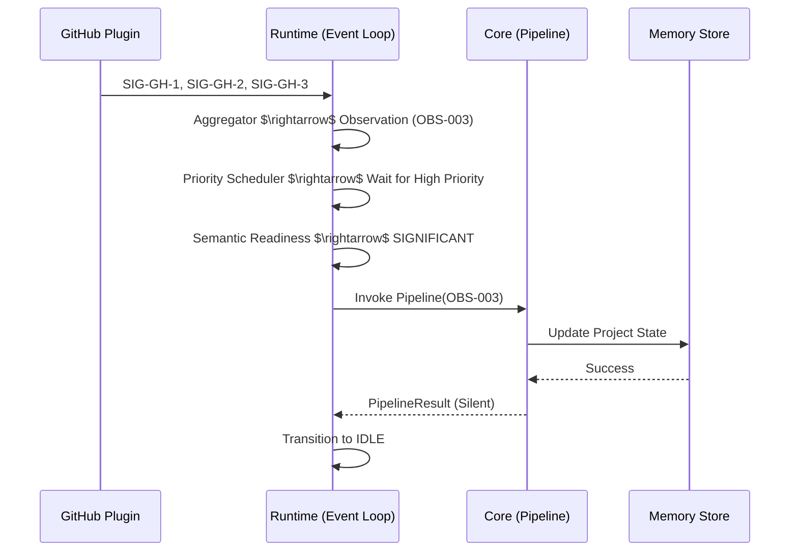
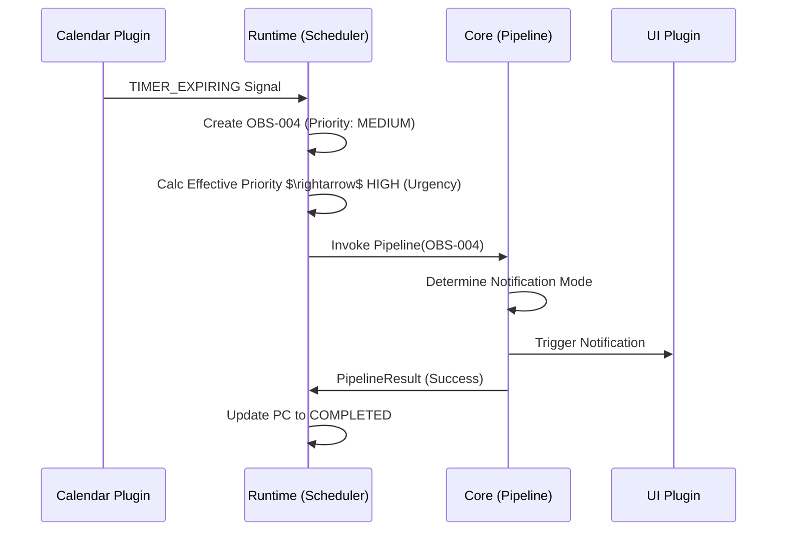

# Execution Traces: Runtime and Core Integration

This document provides detailed end-to-end execution walkthroughs to validate the Telemachus Runtime architecture. These traces demonstrate the flow of information from raw environmental signals through the Runtime's orchestration layer and into the Core's cognitive pipeline.

## Architectural Key

- **Runtime (RT)**: The orchestration layer (Event Loop, Scheduler, Lifecycle Manager).
- **Core (CR)**: The intelligent subsystem (Governance, Cognition, Memory).
- **Plugins (PL)**: External system interfaces.
- **Observation**: Immutable record of a signal processed by the Runtime.
- **Processing Context (PC)**: Mutable state tracking the lifecycle of an Observation.

---

## Trace 1: User Conversation
**Scenario**: User says, "Remind me tomorrow to email Professor Smith."

### Narrative Walkthrough

1.  **Signal Acquisition**: The `Communication Plugin` detects a user text input. It generates a **Raw Signal**: `{type: "USER_INPUT", payload: "Remind me tomorrow to email Professor Smith", timestamp: T0}`.
2.  **Signal Processing**: The RT `Signal Processor` receives the signal. It removes noise and identifies the intent as a request for a future action.
3.  **Observation Creation**: The `Observation Aggregator` promotes the signal to an **Immutable Observation**:
    - `ObsID`: `OBS-001`
    - `Type`: `USER_REQUEST`
    - `Payload`: "Remind me tomorrow to email Professor Smith"
    - `Intrinsic Priority`: `HIGH` (Direct user interaction).
4.  **Processing Context Initialization**: RT creates a `Processing Context` for `OBS-001`:
    - `Effective Priority`: `HIGH`
    - `State`: `QUEUED`
    - `Assigned Pipeline`: `StandardCognitivePipeline`
5.  **Scheduling**: 
    - The `Priority Scheduler` places `OBS-001` at the head of the queue.
    - The `Dependency Analyzer` checks for resource conflicts (e.g., is the Memory Store locked?). No conflicts found.
    - The `Resource Scheduler` grants ownership of the `CognitivePipeline` resource to `OBS-001`.
6.  **Semantic Readiness**: RT evaluates if the Core is ready. Since it's a direct user request, the system is semantically ready.
7.  **Core Invocation (The Pipeline)**:
    - **Communication Stage**: Parses intent $\rightarrow$ "Create Reminder".
    - **Risk Stage**: Evaluates risk of creating a reminder. Result: `LOW` (Reversible, low impact).
    - **Ethics Stage**: Checks against sacred constraints. Result: `ALLOWED`.
    - **Autonomy Stage**: Determines if the action can be autonomous. Result: `STEWARDSHIP` (Can set reminder without explicit confirmation of the exact time if "tomorrow" is clear).
    - **Decision Stage**: Selects the best tool (Calendar/Reminder Plugin).
    - **Execution Stage**: Invokes the `Calendar Plugin` to schedule the reminder for $T0 + 24h$.
    - **Memory Stage**: Stores the interaction and the new reminder in the `INTERACTIONS` and `GOALS` domains.
    - **Learning/Reflection**: Notes that the user prefers specific reminders for academic contacts.
8.  **Persistence**: RT ensures the `Processing Context` is updated to `COMPLETED` and the Memory Store commits the transaction via WAL mode.
9.  **Runtime Response**: RT triggers the `Communication Plugin` to send a confirmation: "I've set a reminder to email Professor Smith tomorrow."

### Sequence Diagram

**Architectural Decision Justification**:
- **Immutable Observations (ADR-004)**: Ensures that the exact user request is preserved regardless of how the Core interprets it.
- **Resource-Based Concurrency (ADR-007)**: Prevents race conditions by ensuring only one observation controls the `CognitivePipeline` at a time.
- **Separation of Authority (ADR-001)**: RT handles *when* and *how* to invoke the Core; the Core handles *what* to do.

---

## Trace 2: Unexpected Shutdown and Recovery
**Scenario**: System crash during a high-priority task, followed by a reboot.

### Narrative Walkthrough

1.  **The Crash**: The system is processing `OBS-002` (Complex research task). The `Processing Context` for `OBS-002` is marked `IN_PROGRESS`. A power failure occurs.
2.  **Restart**: Power is restored. The `Bootstrap Protocol` initiates.
3.  **Recovery Phase**:
    - RT enters `RECOVERY` state.
    - It scans the `Processing Context` logs in the persistence layer.
    - It identifies `OBS-002` as `IN_PROGRESS` at the time of crash.
4.  **Reconciliation**:
    - RT does not blindly replay `OBS-002`. Instead, it enters the `RECONCILIATION` state.
    - It queries the `Memory Store` to see if any partial results from `OBS-002` were committed.
    - It checks the current environment (via Plugins) to see if the external state has changed.
    - It determines that `OBS-002` was in the `Execution` stage but the external API call failed.
5.  **Rescheduling**: RT re-queues `OBS-002` with an increased `Effective Priority` due to "aging" (it was delayed by the crash).
6.  **Running State**: RT transitions to `RUNNING (IDLE)`.
7.  **First User Interaction**: User asks: "Are you back?"
8.  **Recovery Briefing**: 
    - RT recognizes this is the first interaction post-recovery.
    - It invokes the Core to generate a summary: "I experienced an unexpected shutdown. I have recovered my state and am currently resuming the research task I was working on."
    - This is delivered as a "Recovery Briefing" before the normal response.

### Sequence Diagram

**Architectural Decision Justification**:
- **Recovery-First Lifecycle (ADR-002)**: Every boot is treated as a recovery to ensure no state is lost and the system is always consistent with reality.
- **Reconciliation vs. Replay**: Prevents "double-execution" of side effects (e.g., sending two emails) by verifying current state before resuming.

---

## Trace 3: GitHub Repository Activity
**Scenario**: A plugin detects a new commit in a tracked GitHub repository.

### Narrative Walkthrough

1.  **Raw Signals**: The `GitHub Plugin` sends a stream of signals: 
    - `SIG-GH-1`: `COMMIT_CREATED`
    - `SIG-GH-2`: `FILE_CHANGED (main.py)`
    - `SIG-GH-3`: `AUTHOR (Revan)`
2.  **Signal Aggregation**: The RT `Observation Aggregator` recognizes these signals are related by `commit_id`. It merges them into a single **Immutable Observation**:
    - `ObsID`: `OBS-003`
    - `Type`: `EXTERNAL_EVENT`
    - `Payload`: `{event: "COMMIT", author: "Revan", files: ["main.py"], ...}`
    - `Intrinsic Priority`: `MEDIUM`.
3.  **Processing Context**: 
    - `Effective Priority`: `MEDIUM`.
    - `State`: `QUEUED`.
4.  **Scheduling**: The `Priority Scheduler` sees a `HIGH` priority user request in the queue, so `OBS-003` waits.
5.  **Semantic Readiness**: Once the queue clears, RT checks if the Core is ready. Since this is a background event, RT applies a "quiet by default" filter. It determines that if the commit is just a typo fix, it doesn't need to wake the Core. However, since `main.py` changed, it's semantically significant.
6.  **Core Invocation**:
    - **Communication Stage**: Interprets the commit message.
    - **Risk/Ethics/Autonomy**: Low risk, allowed, autonomous.
    - **Decision Stage**: Decides to update the internal project model.
    - **Memory Stage**: Updates the `PROJECTS` domain with the new commit info.
    - **Learning Stage**: Notes a pattern in how Revan is restructuring the code.
7.  **Persistence**: The updated project state is committed to SQLite.
8.  **Runtime State**: RT remains in `RUNNING (IDLE)` as no user notification is required.

### Sequence Diagram

**Architectural Decision Justification**:
- **Universal Observation Model (ADR-003)**: All external events, regardless of source, are normalized into Observations, allowing the Core to process them using a unified pipeline.
- **Semantic Readiness (ADR-005)**: Prevents the Core from being "jittery" by filtering out insignificant noise at the Runtime level.

---

## Trace 4: Calendar Reminder Becoming Urgent
**Scenario**: A reminder set for "Tomorrow" is now 15 minutes away.

### Narrative Walkthrough

1.  **Signal Generation**: The `Calendar Plugin` monitors the clock. It generates a signal: `{type: "TIMER_EXPIRING", target: "OBS-001_REMINDER", time_left: "15m"}`.
2.  **Observation Creation**: RT creates `OBS-004`:
    - `Type`: `TEMPORAL_TRIGGER`
    - `Payload`: "Reminder for Prof. Smith in 15m"
    - `Intrinsic Priority`: `MEDIUM`.
3.  **Processing Context Evolution**:
    - The `Priority Scheduler` calculates the `Effective Priority`. 
    - Because the deadline is approaching, the **Aging/Urgency** factor increases the `Effective Priority` from `MEDIUM` $\rightarrow$ `HIGH`.
4.  **Scheduling**: `OBS-004` now preempts lower-priority background tasks.
5.  **Core Invocation**:
    - **Communication Stage**: Determines the user is currently active (via `Activity Plugin`).
    - **Decision Stage**: Decides how to notify. Since the user is active, it chooses a subtle notification instead of an interrupt.
    - **Execution Stage**: Sends the notification via the `UI Plugin`.
6.  **Persistence**: The reminder status is updated to `NOTIFIED` in the Memory Store.

### Sequence Diagram

**Architectural Decision Justification**:
- **Dual Priority System**: Distinguishes between the *importance* of a task (Intrinsic) and the *urgency* of its execution (Effective), allowing the system to be proactive without being intrusive.
- **Plugin Isolation (ADR-006)**: The Runtime manages the timer, but the Core decides the *mode* of communication, ensuring the "Chief of Staff" persona is maintained.
