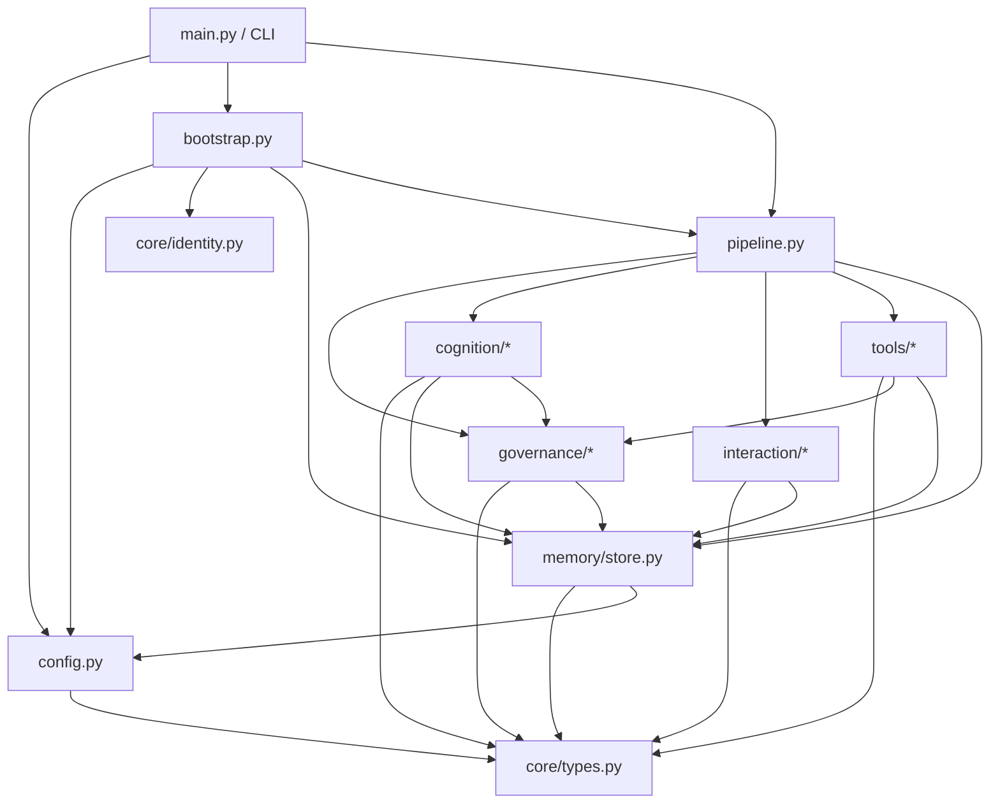
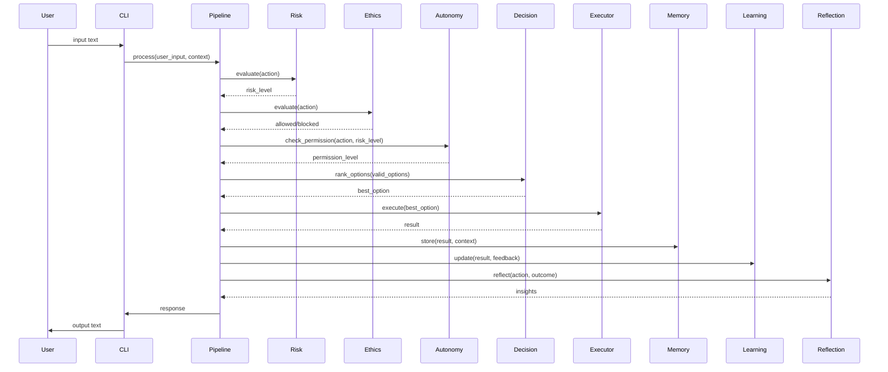

# Telemachus — New Architecture & Development Plan

## 1. Recovered Requirements

### Functional Requirements

| ID | Requirement | Source |
|----|-------------|--------|
| FR1 | System must run entirely locally with no cloud dependencies | CORE_VISION, VISION |
| FR2 | Single command startup (`telemachus start`) | Bootstrap Protocol |
| FR3 | Persistent identity across sessions (Constitution, values, purpose) | IDENTITY, CONSTITUTION |
| FR4 | Multi-domain memory: Revan, Project, World, Emotion, Reflection, Tool | MEMORY_ARCHITECTURE |
| FR5 | Unified semantic index across all memory domains | MEMORY_ARCHITECTURE |
| FR6 | Versioned memory — no deletion, only supersession | MEMORY_ARCHITECTURE |
| FR7 | Cognitive pipeline: Input → Communication → Risk → Ethics → Autonomy → Action → Execution → Memory → Learning → Reflection → Evolution → Output | SYSTEM_INTEGRATION |
| FR8 | Risk evaluation across 6 dimensions: reversibility, resource, system impact, uncertainty, emotional impact, scale | RISK_MODEL |
| FR9 | Ethical boundary enforcement with sacred constraints | ETHICAL_BOUNDARY_ENGINE |
| FR10 | 5-level autonomy system: Observation → Suggestion → Limited → Trusted → Domain Stewardship | AUTONOMY_CHARTER |
| FR11 | Decision framework operating only on pre-approved options | DECISION_FRAMEWORK |
| FR12 | Goal system with 4 sources: assigned, inferred, self-generated, observed | GOAL_SYSTEM |
| FR13 | Project management with lifecycle: creation → structuring → execution → monitoring → reflection | PROJECT_MANAGEMENT |
| FR14 | Research framework with 7-step lifecycle from query to conclusion | RESEARCH_FRAMEWORK |
| FR15 | Learning framework: experience → interpretation → pattern → model update → behavioral adjustment | LEARNING_FRAMEWORK |
| FR16 | Self-reflection protocol with insight extraction and improvement generation | SELF_REFLECTION_PROTOCOL |
| FR17 | Communication with adaptive modes: direct, explained, collaborative | COMMUNICATION_CHARTER |
| FR18 | Emotional model: emotions as information, not commands | EMOTIONAL_MODEL |
| FR19 | Tool creation framework with lifecycle and trust model | TOOL_CREATION_FRAMEWORK |
| FR20 | Bootstrap protocol: load core docs → evaluate state → load memory → reconnect → resume | BOOTSTRAP_PROTOCOL |
| FR21 | First awakening: ask questions before acting | FIRST_AWAKENING |
| FR22 | Long-term evolution with identity preservation | (inferred from gap in LONG_TERM_EVOLUTION.md) |
| FR23 | CLI interface for interaction | (inferred — local system needs interface) |
| FR24 | Graceful shutdown preserving state | (inferred — persistent system) |

### Non-Functional Requirements

| ID | Requirement |
|----|-------------|
| NFR1 | All modules must have type hints (Python) |
| NFR2 | All public APIs must have docstrings |
| NFR3 | All features must have tests |
| NFR4 | All features must have error handling and logging |
| NFR5 | No circular imports |
| NFR6 | No global mutable state (except explicit configuration) |
| NFR7 | Configuration via YAML/TOML file, not hardcoded |
| NFR8 | SQLite for persistence (local-first) |
| NFR9 | Modular architecture — each subsystem independently testable |
| NFR10 | Clean shutdown with state preservation |
| NFR11 | Structured logging with levels and rotation |

---

## 2. New Architecture Design

### 2.1 Directory Structure

```
telemachus/
├── pyproject.toml              # Project metadata, dependencies, build
├── telemachus.toml             # Default configuration
├── README.md                   # Project overview
├── src/
│   └── telemachus/
│       ├── __init__.py
│       ├── main.py             # CLI entry point (click/typer)
│       ├── config.py           # Configuration loading & validation
│       ├── logging_config.py   # Structured logging setup
│       ├── bootstrap.py        # Bootstrap protocol implementation
│       ├── pipeline.py         # Cognitive pipeline orchestrator
│       ├── core/
│       │   ├── __init__.py
│       │   ├── identity.py     # Identity model (Constitution, values, purpose)
│       │   ├── constitution.py # Constitution as immutable data
│       │   └── types.py        # Shared types, enums, dataclasses
│       ├── memory/
│       │   ├── __init__.py
│       │   ├── store.py        # SQLite-backed memory store
│       │   ├── domains.py      # Domain definitions (Revan, Project, etc.)
│       │   ├── index.py        # Unified semantic index
│       │   ├── versioning.py   # Memory versioning
│       │   └── retrieval.py    # Context-aware retrieval
│       ├── governance/
│       │   ├── __init__.py
│       │   ├── risk.py         # Risk Model (6-dimension evaluation)
│       │   ├── ethics.py       # Ethical Boundary Engine
│       │   ├── autonomy.py     # Autonomy Charter (5 levels)
│       │   └── decision.py     # Decision Framework
│       ├── cognition/
│       │   ├── __init__.py
│       │   ├── goals.py        # Goal system
│       │   ├── projects.py     # Project management
│       │   ├── research.py     # Research framework
│       │   ├── learning.py     # Learning framework
│       │   ├── reflection.py   # Self-reflection protocol
│       │   └── evolution.py    # Long-term evolution
│       ├── interaction/
│       │   ├── __init__.py
│       │   ├── communication.py # Communication charter
│       │   ├── emotional.py    # Emotional model
│       │   └── cli_chat.py     # CLI chat interface
│       └── tools/
│           ├── __init__.py
│           ├── registry.py     # Tool registry
│           ├── base.py         # Base tool class
│           └── builtin/        # Built-in tools
│               ├── __init__.py
│               └── ...
├── tests/
│   ├── __init__.py
│   ├── conftest.py             # Shared fixtures
│   ├── test_config.py
│   ├── test_bootstrap.py
│   ├── test_pipeline.py
│   ├── core/
│   ├── memory/
│   ├── governance/
│   ├── cognition/
│   ├── interaction/
│   └── tools/
└── docs/
    ├── architecture.md
    ├── api/
    ├── configuration.md
    └── development.md
```

### 2.2 Module Dependency Graph



### 2.3 Key Design Decisions

1. **Python 3.12+** with full type hints, dataclasses, and match statements.
2. **SQLite** via `sqlite3` (stdlib) for persistence — no ORM, just parameterized queries.
3. **Click** or **Typer** for CLI.
4. **Structlog** or stdlib `logging` with JSON format for structured logging.
5. **TOML** for configuration (pyproject.toml conventions).
6. **Composition over inheritance**: Each subsystem is a class instantiated with its dependencies.
7. **Pipeline pattern**: The cognitive loop is an explicit pipeline with stages that can be composed, reordered, or extended.
8. **Immutable core**: Constitution and identity are loaded as frozen dataclasses — they cannot be mutated at runtime.
9. **Event sourcing for memory**: All memory changes are append-only events; current state is a projection.
10. **Plugin-ready**: Tool registry and pipeline stages are designed for future extension.

### 2.4 Data Flow



---

## 3. Milestone Plan

### Milestone 1 — Project Scaffold & Foundation
**Goal**: Runnable empty system that starts, loads config, initializes logging, and shuts down cleanly.

**Deliverables**:
- `pyproject.toml` with dependencies
- `telemachus.toml` default config
- `src/telemachus/main.py` — CLI with `telemachus start` and `telemachus version`
- `src/telemachus/config.py` — TOML config loader with validation
- `src/telemachus/logging_config.py` — structured JSON logging
- `src/telemachus/core/types.py` — shared enums and dataclasses
- `tests/conftest.py` — pytest fixtures
- `tests/test_config.py`

**Success criteria**: `telemachus start` prints version, loads config, logs startup, exits cleanly.

---

### Milestone 2 — Core Domain Models
**Goal**: Identity and Constitution as loadable, immutable data structures.

**Deliverables**:
- `src/telemachus/core/constitution.py` — Constitution as frozen dataclass
- `src/telemachus/core/identity.py` — Identity model
- `src/telemachus/core/types.py` — expanded enums (RiskLevel, AutonomyLevel, MemoryDomain, etc.)
- Tests for all core models

**Success criteria**: Constitution and Identity load from markdown/text files, validate, and are immutable at runtime.

---

### Milestone 3 — Memory System
**Goal**: SQLite-backed multi-domain memory with versioning and semantic index.

**Deliverables**:
- `src/telemachus/memory/store.py` — SQLite store with connection management
- `src/telemachus/memory/domains.py` — 6 domain definitions with mutability rules
- `src/telemachus/memory/versioning.py` — append-only versioning
- `src/telemachus/memory/index.py` — cross-domain semantic index
- `src/telemachus/memory/retrieval.py` — context/importance/temporal retrieval
- Tests for all memory components

**Success criteria**: Store, retrieve, version, and query across all 6 memory domains. No data is ever deleted.

---

### Milestone 4 — Risk Model + Ethical Boundary Engine
**Goal**: Action evaluation pipeline for risk and ethics.

**Deliverables**:
- `src/telemachus/governance/risk.py` — 6-dimension risk evaluator
- `src/telemachus/governance/ethics.py` — ethical boundary engine with sacred constraints
- Tests for risk and ethics evaluation

**Success criteria**: Given an action description, the system returns a risk level (0-4) and an ethical verdict (allowed/blocked/requires_discussion).

---

### Milestone 5 — Autonomy Charter + Decision Framework
**Goal**: Permission system and option ranking.

**Deliverables**:
- `src/telemachus/governance/autonomy.py` — 5-level autonomy with domain-specific trust
- `src/telemachus/governance/decision.py` — multi-criteria option ranking
- Tests for autonomy and decision systems

**Success criteria**: Autonomy level determined by domain trust; valid options ranked by purpose fit, tradeoffs, outcome quality, context fit.

---

### Milestone 6 — Cognitive Pipeline
**Goal**: The full input→output loop wired together.

**Deliverables**:
- `src/telemachus/pipeline.py` — pipeline orchestrator composing all governance + memory stages
- Integration tests for the full pipeline

**Success criteria**: `pipeline.process(user_input)` runs through all stages in order and returns a result with memory updates.

---

### Milestone 7 — Communication Layer + CLI Chat
**Goal**: Interactive chat with adaptive communication modes.

**Deliverables**:
- `src/telemachus/interaction/communication.py` — communication mode selection and response formatting
- `src/telemachus/interaction/emotional.py` — emotional state tracking
- `src/telemachus/interaction/cli_chat.py` — interactive CLI chat loop
- Tests for communication and emotional models

**Success criteria**: `telemachus chat` opens interactive session with adaptive tone, emotional awareness, and proper response formatting.

---

### Milestone 8 — Learning Framework + Self-Reflection
**Goal**: Experience-based behavioral improvement.

**Deliverables**:
- `src/telemachus/cognition/learning.py` — learning loop with signal processing
- `src/telemachus/cognition/reflection.py` — self-reflection protocol
- Tests for learning and reflection

**Success criteria**: After actions, learning updates occur; reflection extracts insights; both persist to memory.

---

### Milestone 9 — Goal System + Project Management
**Goal**: Proactive goal pursuit and structured project execution.

**Deliverables**:
- `src/telemachus/cognition/goals.py` — goal creation, prioritization, lifecycle
- `src/telemachus/cognition/projects.py` — project lifecycle management
- Tests for goals and projects

**Success criteria**: Goals can be created from all 4 sources; projects track through full lifecycle; both persist to memory.

---

### Milestone 10 — Tool System + Research Framework
**Goal**: Extensible tool registry and structured research.

**Deliverables**:
- `src/telemachus/tools/base.py` — base tool class
- `src/telemachus/tools/registry.py` — tool registry with trust tracking
- `src/telemachus/cognition/research.py` — 7-step research lifecycle
- Tests for tools and research

**Success criteria**: Tools can be registered, executed with permission checks, and tracked; research produces confidence-weighted conclusions.

---

### Milestone 11 — Long-Term Evolution + Bootstrap Protocol
**Goal**: Controlled system evolution and proper startup sequence.

**Deliverables**:
- `src/telemachus/cognition/evolution.py` — evolution with identity preservation checks
- `src/telemachus/bootstrap.py` — 5-phase bootstrap protocol
- Tests for evolution and bootstrap

**Success criteria**: Bootstrap runs the 5-phase sequence; evolution applies changes only when identity-preserving.

---

### Milestone 12 — Documentation, Tests, Validation
**Goal**: Production-ready complete system.

**Deliverables**:
- Full test suite with >80% coverage
- API documentation for all public interfaces
- `README.md` with startup instructions
- Configuration documentation
- Architecture documentation
- Final validation: all imports resolve, all tests pass, startup succeeds, shutdown is graceful

**Success criteria**: `telemachus start` launches the complete system with zero errors.

---

## 4. Engineering Standards

Every module must satisfy:
- [ ] Type hints on all function signatures
- [ ] Google-style docstrings on all public APIs
- [ ] Structured logging at appropriate levels
- [ ] Explicit error handling (no bare excepts)
- [ ] Unit tests for all public methods
- [ ] Integration tests for cross-module interactions
- [ ] No circular imports
- [ ] No mutable global state
- [ ] Configuration-driven behavior (no hardcoded values)

## 5. Technology Stack

| Component | Choice | Rationale |
|-----------|--------|-----------|
| Language | Python 3.12+ | Modern Python, excellent typing, match statements |
| CLI | Typer | Rich help, autocompletion, built on Click |
| Config | TOML (via stdlib tomllib) | Python ecosystem standard |
| Database | SQLite (stdlib sqlite3) | Zero-dependency local persistence |
| Logging | stdlib logging + python-json-logger | Structured JSON logs |
| Testing | pytest + pytest-cov | Industry standard |
| Linting | ruff | Fast, comprehensive |
| Formatting | black | Deterministic |
| Type checking | mypy (strict mode) | Full type safety |
| Build | hatchling | Modern PEP 621 build system |